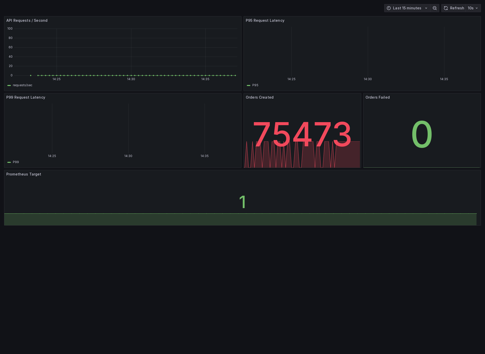

# Chay Enterprise Azure DevSecOps Platform

A hands-on enterprise-style DevSecOps platform built around a FastAPI service, Azure DevOps, private Azure Container Registry, Argo CD, private AKS, Prometheus, Grafana, k6, and Kubernetes Horizontal Pod Autoscaling.

**Author:** Chaithanya Nallamothu
**Role:** Senior DevSecOps Engineer

> This repository documents a platform I built and validated end to end. The application is intentionally small. The main engineering work is around secure CI, immutable artifact management, private Kubernetes delivery, GitOps, runtime security, observability, load testing, autoscaling, and operational recovery.

---

## Project Status

The core implementation is complete and has been validated through the working environment.

The repository currently includes:

- FastAPI application and automated tests
- Docker containerization
- Non-root container runtime
- Azure DevOps CI
- SonarQube Cloud analysis
- Trivy security gates
- Private self-hosted Azure DevOps agent
- Private Azure Container Registry
- Immutable Git-SHA container artifacts
- Helm application packaging
- Argo CD GitOps deployment
- Private AKS runtime
- Prometheus monitoring
- Grafana dashboards
- k6 baseline load testing
- Kubernetes HPA
- k6 autoscaling validation
- Incident and recovery evidence
- Least-privilege AKS validation
- Engineering evidence captured during implementation

The remaining work is mainly documentation consolidation, final architecture diagrams, and final repository review.

---

## Architecture

The implemented delivery path is:

    Developer
        |
        v
    GitHub
        |
        v
    Azure DevOps CI
        |
        +--> Unit Tests
        |
        +--> Ruff
        |
        +--> SonarQube Cloud
        |
        +--> Trivy Security Gates
        |
        v
    Private Azure DevOps Agent
        |
        +--> Production Container Build
        |
        +--> Scan Exact Artifact
        |
        +--> Managed Identity Authentication
        |
        v
    Private Azure Container Registry
        |
        | Immutable Git-SHA Image
        v
    Git Desired State
        |
        v
    Argo CD
        |
        v
    Private AKS
        |
        +--> FastAPI Application
        |
        +--> Horizontal Pod Autoscaler
        |
        +--> Prometheus
        |
        +--> Grafana
        |
        +--> k6 Validation Workloads

Azure DevOps owns CI.

Argo CD owns CD.

The CI pipeline does not directly deploy the production workload to AKS.

Detailed architecture documentation is available in:

[Platform Architecture](docs/architecture.md)

---

## Why I Built the Project This Way

The objective was not to create another demo where a pipeline simply builds an image and runs `kubectl apply`.

I wanted the repository to demonstrate several boundaries that matter in an enterprise platform:

- source validation before artifact creation
- security gates before artifact publication
- immutable container artifacts
- private registry access
- managed identities instead of registry passwords
- separation between CI and deployment
- Git as deployment desired state
- private Kubernetes operations
- non-root workloads
- least-privilege cluster access
- runtime monitoring
- measurable load behavior
- autoscaling validation
- recovery from real implementation failures

Several of these decisions changed while I was building the platform. Those decisions and the reasons behind them are recorded in:

[Engineering Decisions](docs/engineering-decisions.md)

---

## Application

The workload is a small FastAPI API.

The application is intentionally simple because the focus of this repository is the platform around it rather than application complexity.

Implemented endpoints include:

    GET  /
    GET  /health
    GET  /ready
    GET  /version
    GET  /api/orders
    POST /api/orders
    GET  /metrics

The order API supports three controlled execution modes:

    normal
    slow
    fail

These modes are useful for generating predictable runtime behavior during monitoring, load testing, autoscaling, and failure validation.

---

## Local Development

Local development initially exposed a Python compatibility problem.

The machine was using Python 3.14.7 and `pydantic-core` failed during dependency installation because the required PyO3 support did not align with that interpreter version.

Instead of maintaining a local workaround, I standardized development on Python 3.12.

The validated local runtime became:

    Python 3.12.14

This also aligns local development with the Python 3.12 container runtime.

The local regression suite validates:

- liveness
- readiness
- application version
- successful order processing
- controlled failed-order behavior
- Prometheus metrics

Current baseline:

    Tests: 6 passed
    Ruff: passed

Local development evidence:

[Local Development Validation](docs/evidence/01-local-development.md)

---

## Containerization

The application is packaged using:

    python:3.12-slim

The final container runs as a dedicated numeric non-root identity:

    UID 10001
    GID 10001

Using the numeric identity became important during AKS deployment.

The earlier container used the named user `appuser`. It worked during local Docker testing, but Kubernetes later rejected the workload when `runAsNonRoot` could not verify that the named user was non-root.

The final Dockerfile therefore declares:

    USER 10001:10001

The container exposes the FastAPI application on:

    8080

Container validation includes:

- image build
- image metadata inspection
- runtime identity validation
- health validation
- application endpoint validation
- Prometheus metric validation
- post-security-remediation runtime validation

Container evidence:

[Container Build and Runtime Validation](docs/evidence/02-container-validation.md)

---

## Kubernetes Runtime Security

The application workload applies the following runtime controls:

    runAsNonRoot: true

    seccompProfile:
      type: RuntimeDefault

    allowPrivilegeEscalation: false

    capabilities:
      drop:
        - ALL

    readOnlyRootFilesystem: true

The container itself also runs using numeric UID/GID `10001:10001`.

Health and readiness are handled separately through:

    /health
    /ready

Resource requests and limits are defined through Helm rather than relying on Kubernetes defaults.

The current application resources are:

    requests:
      cpu: 5m
      memory: 64Mi

    limits:
      cpu: 250m
      memory: 256Mi

The low CPU request is intentional for this shared validation environment and should not be interpreted as a production sizing recommendation.

---

## Continuous Integration

Azure DevOps owns the CI portion of the platform.

The main CI pipeline is:

    pipelines/azure-pipelines.yml

The primary flow is:

    GitHub
       |
       v
    Application Validation
       |
       v
    Quality Analysis
       |
       v
    Security Validation
       |
       v
    Private Build Agent
       |
       v
    Production Container Build
       |
       v
    Container Security Gate
       |
       v
    Private ACR Publication

The main pipeline contains three major stages:

    Application Validation
    Security Validation
    Build / Scan / Publish Artifact

The application validation stage performs:

- Python 3.12 setup
- dependency installation
- Ruff validation
- pytest execution
- test result publication
- coverage publication
- SonarQube analysis

The security stage performs Trivy-based security validation.

The artifact stage runs on the private self-hosted Azure DevOps agent.

---

## SonarQube Cloud

SonarQube Cloud is integrated into the Azure DevOps validation path.

The project currently reports approximately:

    Coverage: 94.1%
    Security rating: A
    Security issues: 0
    Duplication: 0.0%

The Quality Gate was validated successfully during implementation.

SonarQube remains part of build-time quality analysis.

I intentionally keep this separate from runtime monitoring.

Grafana answers runtime questions.

SonarQube answers source-quality questions.

This avoids turning Grafana into a general project-status dashboard.

---

## Security Scanning

Trivy is used for vulnerability validation.

The project uses a blocking policy focused on fixable:

    HIGH
    CRITICAL

findings.

Unfixed vulnerabilities are excluded from this particular blocking policy so the automated gate focuses on findings that currently have a remediation available.

The initial application image contained:

    Debian HIGH:       9
    Debian CRITICAL:   3
    Python HIGH:       3

    Total blocking:   15

The findings required remediation in two areas.

Python dependencies were updated.

The Debian package layer was also updated during the Docker build.

After remediation, the same blocking policy reported:

    Debian HIGH/CRITICAL: 0
    Python HIGH/CRITICAL: 0

    Total blocking:       0

The security workflow does not stop at obtaining a clean scanner result.

Application tests and runtime validation are executed again after remediation.

Security evidence:

[Container Security Scanning and Remediation](docs/evidence/05-security-scanning.md)

---

## Private Build Agent

The production artifact stage runs on a self-hosted Azure DevOps agent inside the private Azure environment.

Agent:

    chay-secure-api-prod-agent-01

Agent pool:

    Private-Azure-Agent-Pool

The VM does not require a public IP for this workflow.

The private agent provides the network path required for private Azure services and private AKS operations.

It includes tooling required by the project such as:

- Azure CLI
- Docker
- kubectl
- Python
- Git
- Bash

Azure authentication uses the VM's system-assigned managed identity.

---

## Azure Container Registry

Azure Container Registry is the OCI registry used by this project.

Registry:

    chaysecureapiprodacr.azurecr.io

Repository:

    chay-enterprise-devsecops/demo-api

The production image format is:

    chaysecureapiprodacr.azurecr.io/chay-enterprise-devsecops/demo-api:<Git-SHA>

I do not use `latest` for the deployable workload.

The final non-root-remediated artifact used by the GitOps workload is:

    chaysecureapiprodacr.azurecr.io/chay-enterprise-devsecops/demo-api:cce36ef47e07d29ce3e2641a0e7c0e15514da777

Validated registry digest:

    sha256:219ae166d3dccccd3c39d1212a18aec99bf6ef18bdc52340aa184d2bc6093f5da

The Azure DevOps private agent uses:

    AcrPush

The AKS kubelet identity uses:

    AcrPull

The registry administrator account is not required by the pipeline.

Registry passwords are not stored in the repository.

Artifact evidence:

[Azure Container Registry Artifact Publication](docs/evidence/06-acr-artifact.md)

---

## Immutable Artifact Model

The Git commit SHA is used as the container image tag.

This creates a traceable relationship between:

    source revision
        |
        v
    CI run
        |
        v
    container image
        |
        v
    registry digest
        |
        v
    GitOps desired state
        |
        v
    Kubernetes runtime

The production image is built once on the private agent.

Trivy scans that exact image.

If the security gate passes, the same local image is pushed to ACR.

The pipeline does not rebuild a second image after the security scan.

---

## CI and CD Separation

One of the main design decisions in this project is that CI does not own production deployment.

Azure DevOps is responsible for determining whether an artifact is acceptable.

Argo CD is responsible for reconciling the approved desired state into Kubernetes.

The boundary is:

    Azure DevOps
        |
        v
    Validated Immutable Artifact
        |
        v
    Git Desired State
        |
        v
    Argo CD
        |
        v
    AKS

This avoids having two deployment authorities modifying the same Kubernetes workload.

---

## Helm

The application is packaged under:

    helm/chay-demo-api/

The chart contains:

    Chart.yaml
    values.yaml
    templates/deployment.yaml
    templates/service.yaml
    templates/hpa.yaml

Helm defines:

- application image
- immutable image tag
- replica configuration
- service
- container port
- CPU and memory requests
- CPU and memory limits
- liveness probe
- readiness probe
- pod security context
- container security context
- HPA configuration

---

## Argo CD GitOps

Argo CD owns Kubernetes reconciliation.

GitOps configuration is stored under:

    argocd/

The repository contains:

    application.yaml
    monitoring-application.yaml
    project.yaml

The application is deployed into:

    chay-devsecops

Monitoring runs in:

    monitoring

Argo CD automated synchronization is configured with:

    prune
    selfHeal

The project uses a resource whitelist rather than giving unrestricted access to arbitrary Kubernetes resource types.

When HPA support was introduced, the required `HorizontalPodAutoscaler` resource type was added deliberately.

---

## Private AKS

The application runs in a private AKS cluster.

The Kubernetes API is not expected to be directly reachable from the developer laptop.

Private-cluster operations therefore run through the self-hosted Azure DevOps agent.

I did not make AKS public simply to make debugging easier.

This private access model affected several parts of the project:

- GitOps validation
- monitoring validation
- k6 execution
- HPA validation
- Grafana evidence collection
- incident troubleshooting

---

## Least-Privilege AKS Access

The normal validation identity on the private Azure DevOps agent is limited to:

    Azure Kubernetes Service Cluster User Role
    Azure Kubernetes Service RBAC Reader

This is sufficient for the read-only runtime validation performed by the project.

The Reader identity cannot perform unrestricted operations such as:

- arbitrary workload creation
- `kubectl exec`
- pod port forwarding
- cluster administration

Some bootstrap changes required temporary elevated access.

Where this was required, the elevated role was granted only for the controlled operation and removed afterward.

Evidence of privilege revocation is retained in:

    docs/evidence/screenshots/11-autoscaling/
    docs/evidence/screenshots/12-incident-recovery/

Detailed security reasoning is documented in:

[Security Model](docs/security-model.md)

---

## Prometheus Metrics

The FastAPI application exposes Prometheus metrics through:

    /metrics

Application metrics include:

    chay_http_requests_total
    chay_http_request_duration_seconds
    chay_orders_created_total
    chay_orders_failed_total

Prometheus runs inside the Kubernetes environment and scrapes the application.

The monitoring configuration is maintained under:

    monitoring/prometheus/

Prometheus is intentionally lightweight for this shared AKS environment.

The configuration uses short retention and small resource requests because the purpose is application/runtime validation rather than building a large enterprise monitoring cluster inside the portfolio environment.

---

## Grafana

Grafana runs inside the private AKS environment and uses Prometheus as its data source.

The dashboard is:

    Chay Demo API - Runtime Observability

The dashboard includes:

- API requests per second
- P95 request latency
- P99 request latency
- orders created
- orders failed
- Prometheus target health

The dashboard remains private.

I did not create public ingress or a public LoadBalancer simply to capture a screenshot.

The final dashboard evidence was rendered through the private environment, retrieved through the Azure DevOps execution path, validated as a PNG, stored in the repository, and the temporary capture components were removed afterward.

Runtime dashboard evidence:

---

## Runtime Monitoring Validation

Monitoring validation does more than confirm that the Prometheus and Grafana pods are running.

The validation path checks:

- API health
- API readiness
- Prometheus target status
- Prometheus runtime queries
- Grafana health API
- Grafana dashboard provisioning
- private Grafana dashboard reachability

Prometheus queries include:

    sum(chay_http_requests_total)

    sum(rate(chay_http_requests_total[5m]))

    histogram_quantile(...)
    for P95 latency

    histogram_quantile(...)
    for P99 latency

    sum(chay_orders_created_total)

    sum(chay_orders_failed_total)

During one validation run, cumulative application traffic had reached more than 75,000 requests.

When no traffic existed in the current five-minute Prometheus window, rate-based values correctly returned zero or `NaN`.

I retained that behavior instead of manufacturing traffic solely to make the dashboard values look better.

---

## k6 Baseline Load Testing

k6 runs inside the private Kubernetes environment.

The baseline test is stored at:

    load-tests/baseline.js

The scenario uses:

    5 virtual users
    60 second duration

It exercises:

    GET /health
    GET /api/orders

The baseline thresholds include:

    failed requests < 1%
    P95 latency < 1000 ms
    checks > 99%

A successful validation produced:

    Virtual users:       5
    Duration:            1 minute
    Iterations:          595
    Requests:            1,190
    Checks passed:       100%
    Failed requests:     0.00%
    P95 latency:         approximately 3.88 ms

The workload ran inside the cluster instead of exposing the private API externally for load testing.

Evidence:

    docs/evidence/screenshots/10-load-testing/01-k6-private-aks-baseline-passed.png

---

## Horizontal Pod Autoscaling

The application uses Kubernetes HPA.

Current configuration:

    minimum replicas: 1
    maximum replicas: 3
    CPU target:       30%

The HPA configuration is maintained in:

    helm/chay-demo-api/templates/hpa.yaml

The maximum of three replicas is intentional.

This project shares a resource-constrained AKS environment, so the objective is to prove autoscaling behavior without creating unnecessary Azure infrastructure.

---

## Autoscaling Load Test

A separate k6 scenario is used specifically for HPA validation.

File:

    load-tests/autoscaling.js

The scenario uses:

    40 virtual users
    3 minute duration

It continuously sends:

    POST /api/orders

The workload creates CPU pressure on the application.

The autoscaling validation pipeline observes:

- initial HPA state
- current replicas
- desired replicas
- CPU utilization
- pod resource usage
- k6 result
- maximum replica count observed

During successful validation, the application scaled from:

    1 replica
        |
        v
    2 replicas
        |
        v
    3 replicas

The HPA reached the configured maximum of three replicas.

Evidence:

    docs/evidence/screenshots/11-autoscaling/02-hpa-scale-out-under-k6-load.png

---

## Why the HPA Target Is 30%

The first autoscaling configuration used a 50% CPU target.

During load testing, sustained application CPU utilization was approximately 40%.

Kubernetes therefore correctly kept the application at one replica because utilization remained below the configured 50% target.

I did not treat this as an HPA failure.

For the controlled autoscaling demonstration, I changed the target to:

    30%

The same load scenario then produced deterministic scale-out.

The target is intentionally tuned for this small validation environment and is not presented as a general production recommendation.

---

## Capacity Constraint Encountered During Deployment

The first GitOps rollout exposed a Kubernetes scheduling problem.

The node itself was not showing high actual CPU consumption.

The problem was CPU requests already reserved by workloads on the shared node.

Kubernetes scheduling showed the node close to its request capacity.

I evaluated adding another AKS node pool.

That attempt was blocked by the available Sweden Central subscription vCPU quota.

Instead of increasing cost or changing the existing shared platform unnecessarily, I right-sized the demo application's CPU request.

The application request was reduced in controlled steps until the workload could schedule safely within the available environment.

Final request:

    cpu: 5m

The CPU limit remains:

    cpu: 250m

This was an environment-specific engineering decision rather than a production sizing recommendation.

---

## GitOps Artifact Recovery Incident

During one GitOps deployment, the desired immutable image tag could no longer be found in ACR.

Initial symptoms included image-pull errors that could have been interpreted as registry authentication problems.

I verified the registry state from the private agent and confirmed that the requested immutable tag itself was absent.

That changed the diagnosis.

The issue was not simply a missing `AcrPull` assignment.

The recovery path was:

    verify AKS kubelet identity
        |
        v
    verify AcrPull
        |
        v
    verify exact ACR artifact
        |
        v
    identify missing immutable tag
        |
        v
    build and publish verified image
        |
        v
    update Git desired state
        |
        v
    Argo CD reconciliation

This incident reinforced why immutable artifact verification is part of the delivery workflow.

---

## Non-Root Kubernetes Recovery Incident

After solving the artifact problem, another runtime issue appeared.

The pod reported:

    runAsNonRoot and image has non-numeric user (appuser)

The image was already designed to run as a non-root user, but Kubernetes could not verify the named identity numerically.

The Dockerfile was changed to use:

    USER 10001:10001

The corrected image passed:

- local identity validation
- Azure DevOps CI
- Trivy security validation
- ACR publication
- GitOps deployment
- Kubernetes runtime validation

The corrected immutable image is the artifact currently referenced by the Helm desired state.

---

## Docker Desktop Incident

The project also captured a local Docker engine incident.

Docker Desktop initially failed while containerd attempted to write its metadata database.

The error included:

    read-only file system

Subsequent Docker server calls returned HTTP 500 errors.

I checked the Docker context and daemon state to separate the problem from the application or Dockerfile.

The issue was isolated to the local Docker engine.

Docker Desktop was restarted.

After restart:

- Docker client/server communication recovered
- `docker info` worked
- the `desktop-linux` context responded
- `hello-world` ran successfully
- the application image built normally

A factory reset was not required.

Evidence:

    docs/evidence/screenshots/02-docker/troubleshooting/01-docker-engine-500-error.png

---

## Private Grafana Evidence Collection

Grafana was intentionally not exposed publicly.

That made final visual evidence collection more complicated.

The developer Mac could not reach the private AKS service.

The private Azure DevOps VM also could not directly route to the Kubernetes service CIDR.

The Reader identity was not broadened simply to enable port forwarding.

Instead, I used a temporary in-cluster screenshot capture workflow.

The dashboard was rendered from inside the private environment.

The resulting PNG was transferred through an Azure DevOps pipeline artifact.

The final image was validated as:

    PNG
    1920 x 1400
    RGBA

After the evidence was stored in the repository, the temporary screenshot workload and retrieval pipeline were removed.

This preserved the private architecture instead of weakening it for documentation convenience.

---

## Monitoring and CI Visibility Are Separate

The project deliberately separates two types of visibility.

Build-time visibility:

    Azure DevOps
    SonarQube
    Trivy
    ACR artifact metadata

Runtime visibility:

    Prometheus
    Grafana
    Kubernetes metrics
    HPA state
    application logs

I did not push SonarQube or registry information into Grafana merely to create a single dashboard.

Grafana remains focused on the behavior of the running system.

---

## Evidence-Driven Implementation

Evidence was captured throughout the build rather than only after everything became green.

The evidence structure is:

    docs/evidence/screenshots/

Current categories include:

    01-local-development
    02-docker
    03-ci
    04-sonarqube
    05-security
    06-acr
    09-monitoring
    10-load-testing
    11-autoscaling
    12-incident-recovery

The repository intentionally retains evidence of failures and remediation where those failures affected an engineering decision.

---

## Repository Structure

    .
    ├── application/
    │   ├── src/
    │   ├── tests/
    │   ├── Dockerfile
    │   ├── requirements.txt
    │   └── requirements-dev.txt
    │
    ├── pipelines/
    │   ├── azure-pipelines.yml
    │   ├── argocd-bootstrap.yml
    │   ├── gitops-validation.yml
    │   ├── monitoring-bootstrap.yml
    │   ├── hpa-authorization.yml
    │   └── autoscaling-validation.yml
    │
    ├── helm/
    │   └── chay-demo-api/
    │
    ├── argocd/
    │
    ├── monitoring/
    │   └── prometheus/
    │
    ├── load-tests/
    │   ├── baseline.js
    │   └── autoscaling.js
    │
    ├── docs/
    │   ├── architecture.md
    │   ├── engineering-decisions.md
    │   ├── security-model.md
    │   └── evidence/
    │
    └── README.md

---

## Existing Azure Infrastructure

This workload reuses an existing private Azure platform.

The shared platform includes:

- private AKS
- private Azure Container Registry
- hub/spoke networking
- private endpoints
- managed identities
- private Azure DevOps agent
- supporting Azure services

This repository does not claim Terraform ownership of those shared resources.

The `terraform/` directory is therefore intentionally not used to recreate or import the existing platform.

I did not create a competing Terraform state solely to make the portfolio repository appear self-contained.

The repository owns the application delivery and runtime configuration associated with this project.

---

## Cost Awareness

Cost was treated as an engineering constraint during implementation.

The project reuses the existing private AKS platform instead of creating another cluster.

A dedicated AKS node pool was considered during the scheduling incident but was not pursued after the regional quota constraint was identified.

Monitoring was intentionally kept lightweight.

The HPA maximum is limited to three replicas.

Temporary evidence-collection workloads are removed after use.

The goal was to demonstrate the platform controls without consuming Azure resources that do not materially improve the project.

---

## Security Model

The main security controls implemented in this repository include:

- private AKS
- private ACR
- managed identity authentication
- separate `AcrPush` and `AcrPull` identities
- no ACR administrator credentials in CI
- immutable Git-SHA artifacts
- Trivy vulnerability gates
- SonarQube analysis
- non-root containers
- numeric UID/GID
- read-only root filesystem
- dropped Linux capabilities
- no privilege escalation
- RuntimeDefault seccomp
- health and readiness probes
- resource requests and limits
- GitOps deployment control
- restricted Argo CD resource scope
- least-privilege AKS Reader validation
- temporary privilege revocation after bootstrap
- private runtime monitoring

Detailed documentation:

[Security Model](docs/security-model.md)

---

## Engineering Decisions

Important implementation decisions are documented separately because several of them came directly from issues encountered while building the platform.

Examples include:

- Azure DevOps owns CI while Argo CD owns CD
- immutable Git-SHA image tags
- scan the exact artifact that is published
- managed identity instead of registry passwords
- keep AKS private during troubleshooting
- do not take Terraform ownership of shared infrastructure
- standardize development on Python 3.12
- use numeric non-root UID/GID
- right-size the workload instead of adding unnecessary capacity
- use lightweight Prometheus/Grafana
- run k6 inside the private environment
- tune HPA for the actual validation environment
- revoke temporary elevated permissions
- keep Grafana private even during evidence collection

See:

[Engineering Decisions](docs/engineering-decisions.md)

---

## Evidence Documentation

Current detailed evidence documents:

- [Local Development Validation](docs/evidence/01-local-development.md)
- [Container Build and Runtime Validation](docs/evidence/02-container-validation.md)
- [Container Security Scanning and Remediation](docs/evidence/05-security-scanning.md)
- [Azure Container Registry Artifact Publication](docs/evidence/06-acr-artifact.md)

Additional implementation evidence is already captured in screenshots and will be consolidated into dedicated documentation for:

- Azure DevOps CI
- SonarQube
- GitOps
- AKS runtime
- monitoring
- load testing
- autoscaling
- incident recovery

---

## Key Validation Results

Application:

    Tests: 6 passed
    Coverage: approximately 94.1%
    Ruff: passed

Container security remediation:

    Initial blocking HIGH/CRITICAL findings: 15
    Final blocking HIGH/CRITICAL findings:    0

k6 baseline:

    VUs:                 5
    Duration:            60 seconds
    Requests:            1,190
    Checks passed:       100%
    Failed requests:     0.00%
    P95:                 approximately 3.88 ms

HPA:

    Minimum replicas:    1
    Maximum replicas:    3
    CPU target:          30%
    Validated scale-out: 1 -> 3 replicas

Artifact:

    Registry: private ACR
    Tagging: full Git SHA
    Authentication: managed identity
    Registry admin: disabled/not required

Kubernetes:

    Private cluster
    Non-root workload
    GitOps reconciliation
    Least-privilege validation path

---

## What This Project Demonstrates

This repository is intended to demonstrate practical experience across:

- Azure
- Azure DevOps
- GitHub
- Docker
- Kubernetes
- AKS
- Azure Container Registry
- Helm
- Argo CD
- GitOps
- Python/FastAPI
- SonarQube
- Trivy
- Prometheus
- Grafana
- k6
- Kubernetes HPA
- managed identities
- Azure RBAC
- private networking
- CI/CD security controls
- container security
- observability
- load testing
- autoscaling
- incident troubleshooting
- operational recovery
- cost-aware platform engineering

The repository includes both the final configuration and the reasoning/evidence behind the changes that were required to reach it.

---

## Documentation Roadmap

The remaining documentation work will consolidate the implementation into:

    docs/architecture.md
    docs/engineering-decisions.md
    docs/security-model.md
    docs/operations-runbook.md

and evidence documents for:

    01 - Local Development
    02 - Container Validation
    03 - Azure DevOps CI
    04 - SonarQube Quality Validation
    05 - Security Scanning
    06 - ACR Artifact Publication
    07 - Argo CD / GitOps
    08 - AKS Runtime
    09 - Observability
    10 - k6 Load Testing
    11 - HPA Autoscaling
    12 - Incident and Recovery

The final documentation pass will also add architecture diagrams based on the platform that was actually implemented rather than generic reference architecture diagrams.

---

## Architecture Diagrams

The final diagrams will be maintained under:

    docs/diagrams/

The primary architecture diagram will show:

    Developer
        |
        v
    GitHub
        |
        v
    Azure DevOps
        |
        +--> Tests
        +--> SonarQube
        +--> Trivy
        |
        v
    Private Build Agent
        |
        v
    Private ACR
        |
        v
    GitOps
        |
        v
    Argo CD
        |
        v
    Private AKS
        |
        +--> Application
        +--> HPA
        +--> Prometheus
        +--> Grafana
        +--> k6

A second diagram can show the security and trust boundaries:

    Developer / Source
           |
           v
    CI Quality & Security
           |
           v
    Private Build Boundary
           |
           v
    Artifact Boundary
           |
           v
    GitOps Deployment Boundary
           |
           v
    Private Runtime Boundary
           |
           v
    Observability Boundary

These diagrams will be created from the actual implementation using Miro or Lucidchart rather than using a generic cloud architecture template.

---

## Final Note

This project evolved while I was building it.

Some of the most useful parts were not planned screenshots of successful pipelines. They were the points where the implementation behaved differently from the initial assumption:

- the local Python version was incompatible with the dependency toolchain;
- the original image contained fixable security findings;
- Docker Desktop itself failed during the container workflow;
- the shared AKS node could not schedule the original CPU request;
- regional quota prevented the obvious additional-node solution;
- an immutable image expected by GitOps was no longer present in ACR;
- a named non-root container user was not sufficient for Kubernetes `runAsNonRoot`;
- the first HPA threshold correctly did not trigger scaling;
- private Grafana evidence could not simply be opened from the developer laptop.

The final design reflects those findings.

That implementation history is intentionally preserved because it shows not only what the platform looks like when it works, but how I validated assumptions, isolated failures, changed the design, and verified recovery.
