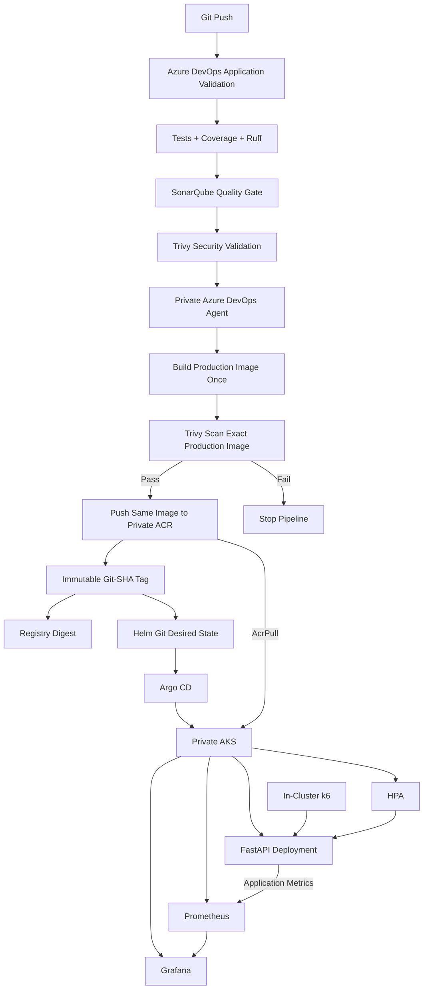

# CI, Artifact and GitOps Flow

**Author:** Chaithanya Nallamothu
**Role:** Senior DevSecOps Engineer

## Delivery Control

The implementation separates four responsibilities:

    Source and Quality
        |
        v
    Artifact Validation
        |
        v
    GitOps Deployment
        |
        v
    Runtime Operations

The production image is built once, scanned, and then pushed as the same artifact.

The artifact uses the Git commit SHA rather than a mutable deployment tag.

A successful CI pipeline does not directly mutate the production Kubernetes workload.

The approved immutable image becomes part of Git desired state, and Argo CD performs reconciliation.
