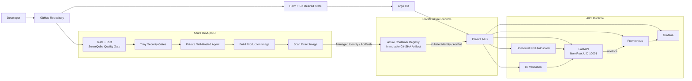

# End-to-End Platform Architecture

**Author:** Chaithanya Nallamothu
**Role:** Senior DevSecOps Engineer

## Responsibility Boundaries

Azure DevOps owns continuous integration, source validation, security gates, and production artifact publication.

Argo CD owns Kubernetes deployment reconciliation.

AKS consumes the validated immutable image from private ACR using the kubelet identity.

Prometheus and Grafana provide runtime observability.

k6 executes inside the private Kubernetes environment.

The normal CI workflow does not directly deploy the production application to AKS.
