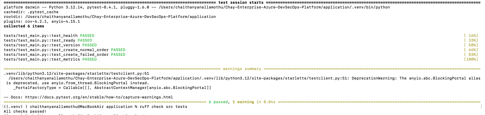
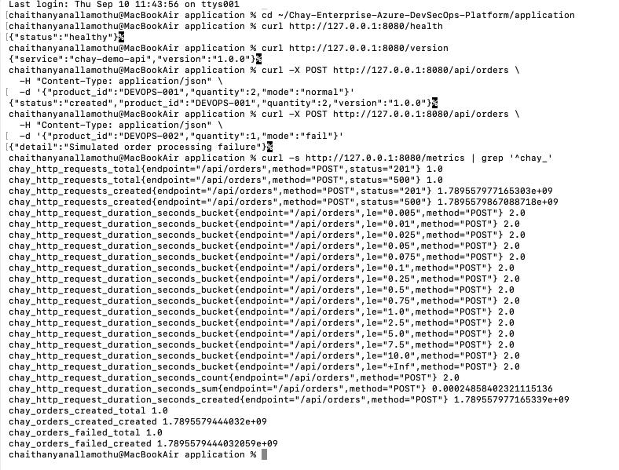

# Local Development Validation

## Purpose

This evidence validates the application locally before containerization and CI/CD integration. The goal was to establish a known-good baseline for application behavior, automated tests, code quality, and Prometheus instrumentation.

## Runtime Standardization

The initial local environment used Python 3.14.7. During dependency installation, `pydantic-core` failed to build because the required PyO3 version did not support Python 3.14.

To keep local development aligned with the container runtime, the project was standardized on Python 3.12.

The local virtual environment was recreated using:

```bash
/opt/homebrew/bin/python3.12 -m venv .venv
source .venv/bin/activate
```

Validated runtime:

```text
Python 3.12.14
```

This aligns local development with the application's `python:3.12-slim` container base.

## Automated Validation

The application test suite covers:

- Liveness endpoint
- Readiness endpoint
- Application version
- Successful order processing
- Controlled order-processing failure
- Prometheus metrics endpoint

Validation commands:

```bash
pytest -v
ruff check src tests
```

Result:

```text
6 tests passed
Ruff: All checks passed
```



## API Validation

The FastAPI application was started locally with Uvicorn:

```bash
uvicorn src.main:app --host 127.0.0.1 --port 8080
```

The following endpoints were validated:

```text
GET  /health
GET  /ready
GET  /version
GET  /api/orders
POST /api/orders
GET  /metrics
```

The order API supports controlled `normal`, `slow`, and `fail` execution modes. These modes allow later load-testing, observability, autoscaling, and incident-recovery scenarios to generate measurable application behavior.

## Prometheus Instrumentation

Application-level metrics exposed through `/metrics` include:

```text
chay_http_requests_total
chay_http_request_duration_seconds
chay_orders_created_total
chay_orders_failed_total
```

Local validation generated both successful and failed order requests and confirmed that the corresponding counters were exported through the Prometheus endpoint.



## Engineering Outcome

Before containerization, the application had a repeatable local baseline:

- Python runtime aligned with the container runtime
- Automated regression tests passing
- Static lint validation passing
- Health and readiness endpoints operational
- Successful and controlled-failure application paths validated
- Prometheus instrumentation producing application metrics

This baseline is used by subsequent container, security, CI, GitOps, monitoring, load-testing, and incident-recovery stages.
