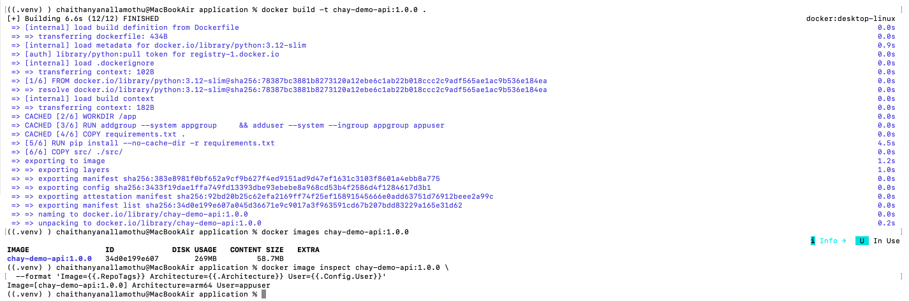
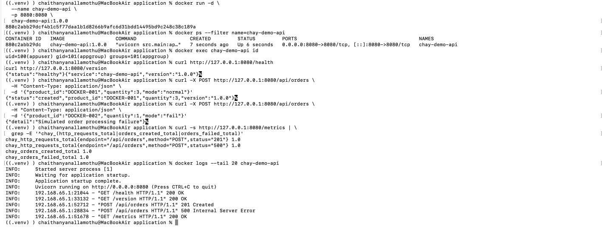
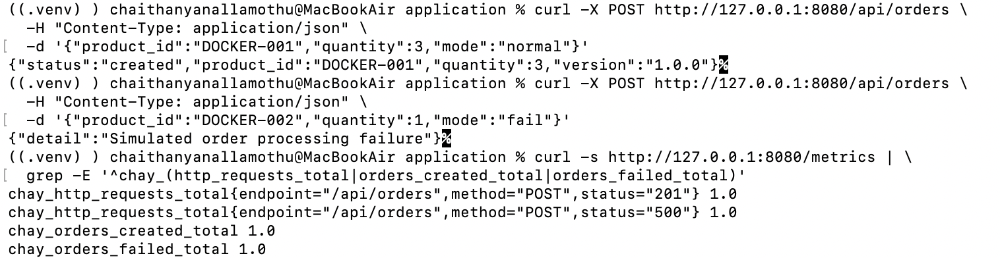
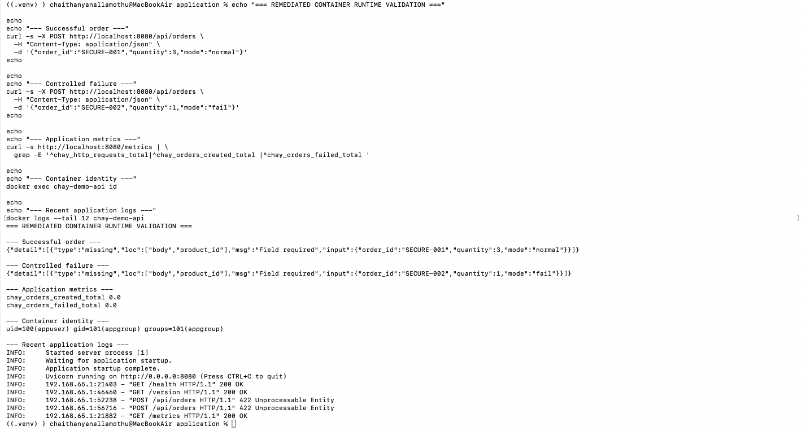

# Container Build and Runtime Validation

## Purpose

This evidence validates that the application can be packaged and executed as a reproducible Docker container while maintaining the runtime and security controls expected for later CI/CD and Kubernetes deployment.

## Container Design

The application container is based on:

```text
python:3.12-slim
```

The image is configured to:

- Run the FastAPI application through Uvicorn
- Expose application traffic on port `8080`
- Install only declared runtime dependencies
- Run the application as a dedicated non-root user
- Keep the application version visible through the `/version` endpoint

The initial application artifact was built as:

```text
chay-demo-api:1.0.0
```

## Image Build Validation

The container image was built locally and inspected before runtime validation.

Validation confirmed:

```text
Image: chay-demo-api:1.0.0
Architecture: arm64
Runtime user: appuser
```



## Non-Root Runtime Validation

The container was started locally with port `8080` published to the host.

Runtime identity was verified from inside the running container:

```bash
docker exec chay-demo-api id
```

Result:

```text
uid=100(appuser) gid=101(appgroup) groups=101(appgroup)
```

This confirms that the application process does not require root privileges.

## Application Validation Inside Docker

The containerized application was validated through:

```text
GET  /health
GET  /version
POST /api/orders
GET  /metrics
```

Both successful and controlled-failure order paths were exercised.

Prometheus metrics confirmed that containerized application activity was observable through:

```text
chay_http_requests_total
chay_orders_created_total
chay_orders_failed_total
```

Application logs also confirmed the expected HTTP success and failure responses.



## Docker Desktop Engine Incident

During the initial container workflow, Docker Desktop encountered a local engine failure.

The first image build failed while containerd attempted to write its metadata database:

```text
read-only file system
/var/lib/desktop-containerd/daemon/io.containerd.metadata.v1.bolt/meta.db
```

Subsequent Docker server requests returned HTTP 500 responses through the Docker Desktop socket.

The incident was captured before remediation:



### Investigation

The following checks were used to distinguish a Docker daemon problem from an application or Dockerfile problem:

```bash
docker desktop status
docker context show
docker version
docker info
```

Docker Desktop reported a running application and the expected `desktop-linux` context, while server requests continued to fail.

This isolated the issue to the local Docker engine rather than the application build.

### Recovery

The Docker Desktop engine was restarted using:

```bash
docker desktop restart
```

After restart:

- Docker client/server communication recovered
- `docker info` completed successfully
- The `desktop-linux` engine became responsive
- `docker run --rm hello-world` completed successfully
- The application image subsequently built successfully

A factory reset was not required.

## Security-Remediated Container

Security scanning of `1.0.0` later identified fixable operating-system and Python dependency vulnerabilities. Those findings are documented separately in `05-security-scanning.md`.

A remediated immutable artifact was created as:

```text
chay-demo-api:1.0.1
```

The updated container retained the non-root runtime model and application behavior.

Runtime validation confirmed:

```text
Image: chay-demo-api:1.0.1
User: appuser
Health: healthy
Application version: 1.0.1
```

Successful and controlled-failure order requests were executed again after remediation, and application metrics and logs remained operational.



## Immutable Versioning

The original and remediated images were retained as separate local artifacts:

```text
chay-demo-api:1.0.0
chay-demo-api:1.0.1
```

The original artifact was not overwritten. This provides a reproducible before-and-after security remediation trail and establishes the immutable versioning model that will later be used by the artifact repository and GitOps deployment workflow.

## Engineering Outcome

Container validation established that:

- The application builds reproducibly as a Docker image
- The runtime executes as a non-root user
- Health and application endpoints operate correctly in the container
- Prometheus instrumentation remains available after containerization
- Controlled application failures remain observable
- A real Docker engine incident was isolated and recovered without modifying application code
- Security remediation produced a separately versioned immutable image
- The remediated image preserved expected runtime behavior

The validated container artifact is ready to become an input to the CI security and artifact-management stages.
