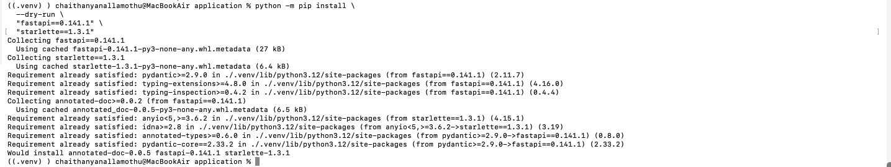
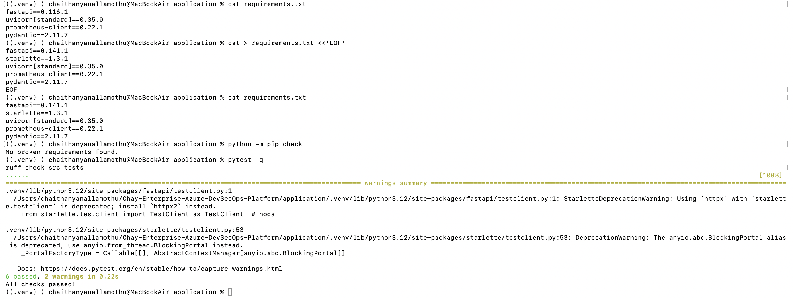
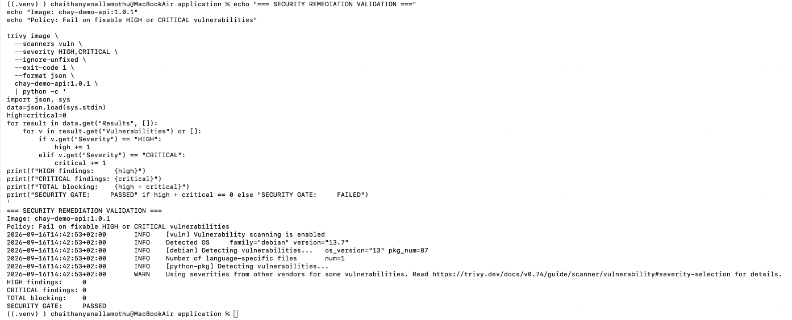

# Container Security Scanning and Remediation

## Purpose

This evidence documents vulnerability detection, remediation, regression validation, and enforcement for the application container.

The objective was not only to generate a vulnerability report, but to establish a security control that can later be enforced automatically in CI.

## Security Tooling

Container vulnerability analysis was performed with Trivy.

Validated local version:

```text
Trivy 0.74.0
```

The scan policy focused on fixable vulnerabilities with the following severities:

```text
HIGH
CRITICAL
```

Unfixed findings were excluded from the blocking policy so the gate focuses on vulnerabilities for which remediation is currently available.

## Initial Scan

The original application image was:

```text
chay-demo-api:1.0.0
```

The initial Trivy scan was executed with:

```bash
trivy image \
  --severity HIGH,CRITICAL \
  --ignore-unfixed \
  chay-demo-api:1.0.0
```

The scan identified blocking findings in both the Debian operating-system layer and the Python dependency layer.

### Debian Findings

The Debian image contained:

```text
HIGH:      9
CRITICAL:  3
TOTAL:    12
```

Affected packages included:

```text
gzip
libpcre2-8-0
libsqlite3-0
perl-base
```

Trivy reported fixed package versions for these findings, making them actionable remediation candidates.

### Python Dependency Findings

The Python dependency scan identified three HIGH-severity findings associated with the installed Starlette version:

```text
Starlette 0.47.3

HIGH: 3
```

The findings had remediation versions available.

Across the operating-system and Python layers, the original image therefore contained:

```text
HIGH:      12
CRITICAL:   3
TOTAL:     15 blocking findings
```

## Dependency Remediation Analysis

The original application dependency set pinned:

```text
FastAPI  0.116.1
Starlette 0.47.3 (resolved transitively)
```

Simply upgrading FastAPI was evaluated first.

A pip dry-run showed that upgrading FastAPI alone could leave the existing Starlette `0.47.3` installation in place because it still satisfied FastAPI's dependency range.

The remediation was therefore tested explicitly with:

```text
FastAPI  0.141.1
Starlette 1.3.1
```

The pip dependency resolver accepted this combination.



## Dependency Regression Validation

The remediated dependency versions were installed locally and validated before changing the container artifact.

The application requirements were updated to explicitly pin:

```text
fastapi==0.141.1
starlette==1.3.1
```

Dependency consistency was checked with:

```bash
python -m pip check
```

Result:

```text
No broken requirements found.
```

Application regression validation was then executed:

```bash
pytest -q
ruff check src tests
```

Result:

```text
6 tests passed
Ruff: All checks passed
```

The test run produced deprecation warnings from the FastAPI/Starlette test-client stack. These warnings did not represent test failures and are tracked separately from the vulnerability remediation.



## Base Image Analysis

A fresh `python:3.12-slim` image was pulled before changing the Dockerfile.

The refreshed base image resolved to:

```text
sha256:78387bc3881b8273120a12ebe6c1ab22b018ccc2c9adf565ae1ac9b536e184ea
```

Scanning the fresh base image still reported:

```text
Debian 13.6
HIGH:      9
CRITICAL:  3
TOTAL:    12
```

This demonstrated that simply rebuilding against the refreshed upstream tag was insufficient to remediate the fixable operating-system vulnerabilities.

## Operating-System Remediation

The Docker build was updated to apply available Debian package updates:

```dockerfile
RUN apt-get update \
    && apt-get upgrade -y \
    && rm -rf /var/lib/apt/lists/*
```

The package metadata is removed in the same image layer after the upgrade.

The application version was also incremented:

```text
1.0.0 -> 1.0.1
```

This preserved the original artifact and produced a separately identifiable remediated artifact.

## Remediated Image Build

The new image was built without using cached application layers:

```bash
docker build \
  --pull \
  --no-cache \
  -t chay-demo-api:1.0.1 \
  .
```

Image inspection confirmed:

```text
Image:        chay-demo-api:1.0.1
Architecture: arm64
User:         appuser
APP_VERSION:  1.0.1
```

The original image remained available as:

```text
chay-demo-api:1.0.0
```

This provides an immutable before-and-after remediation trail.

## Post-Remediation Vulnerability Scan

The remediated image was scanned using the same HIGH/CRITICAL policy:

```bash
trivy image \
  --scanners vuln \
  --severity HIGH,CRITICAL \
  --ignore-unfixed \
  chay-demo-api:1.0.1
```

The remediated image was detected as Debian 13.7.

Result:

```text
Debian HIGH/CRITICAL findings: 0
Python HIGH/CRITICAL findings: 0
TOTAL BLOCKING FINDINGS:       0
```

The remediation reduced the blocking vulnerability count from:

```text
15 -> 0
```

## Enforced Security Gate

The final validation used Trivy's exit-code behavior so the same policy can block a CI pipeline:

```bash
trivy image \
  --scanners vuln \
  --severity HIGH,CRITICAL \
  --ignore-unfixed \
  --exit-code 1 \
  chay-demo-api:1.0.1
```

Gate behavior:

```text
0 = security policy passed
1 = blocking HIGH/CRITICAL vulnerability detected
```

For `chay-demo-api:1.0.1`, the gate completed successfully:

```text
HIGH findings:      0
CRITICAL findings:  0
TOTAL blocking:     0
SECURITY GATE:      PASSED
```



## Runtime Validation After Remediation

Security remediation was followed by runtime validation rather than treating a clean scanner result as sufficient proof of application readiness.

The `1.0.1` container was started and verified as:

```text
Image:   chay-demo-api:1.0.1
User:    appuser
Health:  healthy
Version: 1.0.1
```

Successful and controlled-failure order requests were executed again. Prometheus metrics and application logs continued to report the expected behavior.

Runtime evidence is maintained in:

```text
02-container-validation.md
```

## Security Outcome

The remediation workflow established the following security controls:

- Vulnerability scanning covers both OS packages and Python dependencies
- HIGH and CRITICAL fixable findings are treated as blocking conditions
- Dependency remediation is regression-tested before image promotion
- Base-image findings are validated independently from application dependencies
- Remediation produces a new immutable image rather than overwriting the original artifact
- The container continues to execute as a non-root user
- Security changes are followed by functional runtime validation
- Trivy exit codes provide an enforceable CI security gate

## Before and After

| Control | `1.0.0` | `1.0.1` |
|---|---:|---:|
| Debian HIGH | 9 | 0 |
| Debian CRITICAL | 3 | 0 |
| Python HIGH | 3 | 0 |
| Total blocking findings | 15 | 0 |
| Non-root runtime | Yes | Yes |
| Regression tests | Baseline passed | 6 passed |
| Ruff validation | Passed | Passed |
| Security gate | Would block | Passed |

The same security policy will be integrated into Azure DevOps so vulnerable artifacts cannot progress to artifact publication or GitOps promotion.
